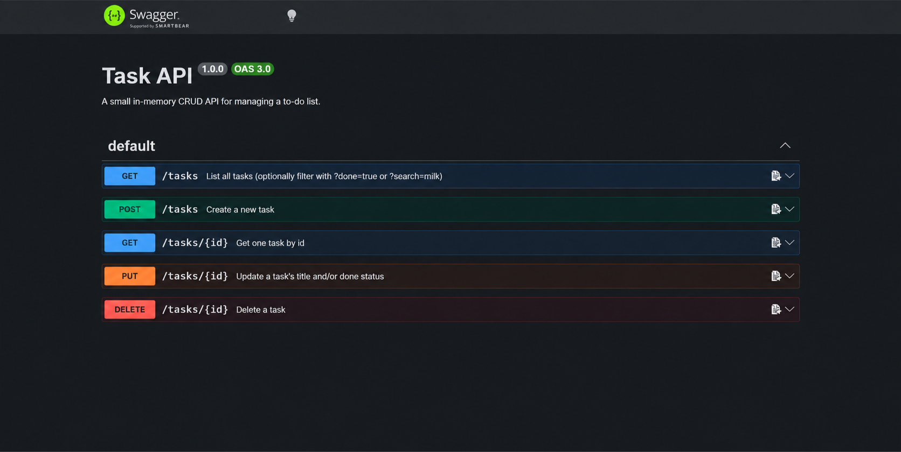

# Task API

A small in-memory CRUD API for a to-do list, built for FlyRank Internship — Backend Track, Week 2, Assignment A1.

## What this is

An Express server with 5 CRUD endpoints over an in-memory task list (`{ id, title, done }`), interactive
docs via Swagger UI, plus a couple of optional extras (filtering, `/stats`, `/reset`).

## How to install & run

```
npm install
npm start
```

The server starts on **http://localhost:3000**.

## Endpoints

| Method | Path         | Meaning                              | Success | Errors        |
|--------|--------------|---------------------------------------|---------|---------------|
| GET    | /            | API description                       | 200     | –             |
| GET    | /health      | Liveness check                        | 200     | –             |
| GET    | /tasks       | List all tasks (`?done=`, `?search=`) | 200     | –             |
| GET    | /tasks/:id   | Get one task                          | 200     | 404           |
| POST   | /tasks       | Create a task (`{ "title": "..." }`)  | 201     | 400           |
| PUT    | /tasks/:id   | Update title and/or done              | 200     | 400, 404      |
| DELETE | /tasks/:id   | Delete a task                         | 204     | 404           |
| POST   | /reset       | Restore the 3 seed tasks (extra)      | 200     | –             |
| GET    | /stats       | `{ total, done, open }` (extra)       | 200     | –             |

## Swagger UI

Visit **http://localhost:3000/docs** — every endpoint is listed with a "Try it out" button.



## Sample curl output (full CRUD cycle)

```
$ curl -i -X POST http://localhost:3000/tasks -H "Content-Type: application/json" -d '{"title":"Buy milk"}'
HTTP/1.1 201 Created
Content-Type: application/json

{"id":4,"title":"Buy milk","done":false}

$ curl -i -X PUT http://localhost:3000/tasks/4 -H "Content-Type: application/json" -d '{"done":true}'
HTTP/1.1 200 OK
Content-Type: application/json

{"id":4,"title":"Buy milk","done":true}

$ curl -i -X DELETE http://localhost:3000/tasks/4
HTTP/1.1 204 No Content

$ curl -i http://localhost:3000/tasks/4
HTTP/1.1 404 Not Found
Content-Type: application/json

{"error":"Task 4 not found"}
```

## The mortality experiment

Restart the server and `GET /tasks` — you're back to the 3 seed tasks. Everything you created is gone,
<<<<<<< HEAD
because it only ever lived in a plain JavaScript array in RAM, not on disk. Fixing that is what Week 3
(a real database) is for.

## Why SQLite?

Tasks now live in `tasks.db` instead of in memory. SQLite is a single file
with no separate server to install or run — perfect for a small project
like this one. Data now survives a server restart, which it never did in
the in-memory version.

`tasks.db` is created automatically the first time the server runs, and
it's git-ignored, so a fresh clone always starts with a clean 3-task
database.

## Example manual query (Stage 4)

    SELECT * FROM tasks WHERE done = 1;

Ran this directly against `tasks.db` (bypassing the API entirely) and it
returned the one seeded task already marked done:
`{"id":3,"title":"Write README","done":1}` — same file the API reads
from, no syncing required.


## Running with Docker (Week 1 A3)

    cp .env.example .env
    docker compose up

Starts the API and a Postgres 16 database together with one command.
The database's data lives in a named volume (`taskdata`), so it survives
`docker compose down` and `up` again — proven by creating a task, tearing
the whole stack down, bringing it back up, and confirming the task was
still there with no manual database setup.

Postgres replaces SQLite from A2 — same API, same endpoints, same status
codes, now backed by a real database server instead of a single file,
running the same way on any machine with Docker installed.
